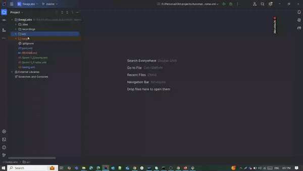

# Swag Labs Test Automation

## Table of Contents

- [Introduction](#introduction)
- [Features](#features)
- [Objectives](#Objectives)
- [Scope](#Scope)
- [Test environment](#Environment)
- [Installation](#installation)
- [Usage](#usage)
- [Contributing](#contributing)
- [License](#license)

## Introduction

SwagLabs is a comprehensive e-commerce platform designed to help users explore and purchase a wide range,Users can browse products, 
compare features, read reviews, and make purchases through a user-friendly interface
 This repository contains the source code for the SwagLabs application.

## Features

- *Account Management*: Create and manage acounts and profile .
- *Cart*: Add products from the cart
- *products purshes *: Add products to cart and make success ordered.
- *Payment methods Security*: Ensure secure and encrypted transactions.

## Objectives
The objectives of automation testing for the Swag Labs are as follows:
- To ensure that the Swag Labs application is stable and reliable.
- To increase the speed of testing and reduce manual effort. 
- To reduce the overall cost of testing. 
- To ensure that all items added to cart are going to checkout. 
- To ensure that the prices are correct.

## Scope
The scope of automation testing includes:
- Functional testing of all modules.
- Regression testing of all modules.

## Environment
The test environment for automation testing is as follows:
- Browser: Google Chrome Version 129.0.6668.101
- Browser: Mozilla Firefox Version 130.0.1
- Programming language: Java

## Installation

To set up the SwagLabs application locally, follow these steps:

1. Clone the repository:
*   git clone https://github.com/AhmedAbdelkawy-hub/SwagLabs.git
2. Navigate to the project directory:
*   cd SwagLabs
3. Install dependencies:
*   npm install
4. Configure the application:

* Update configuration files with necessary settings.
5. Run the application:
*   npm start

## Usage
* User Guide: Refer to the User Guide for detailed information on how to use the SwagLabs application.

### Local testing execution example

## Contributing
* We welcome contributions from the community. To contribute to SwagLabs, follow these steps:

## Fork the repository.
* Create a new branch for your feature or bug fix.
* Make your changes and submit a pull request.

## License
* SwagLabs is licensed under the MIT License.